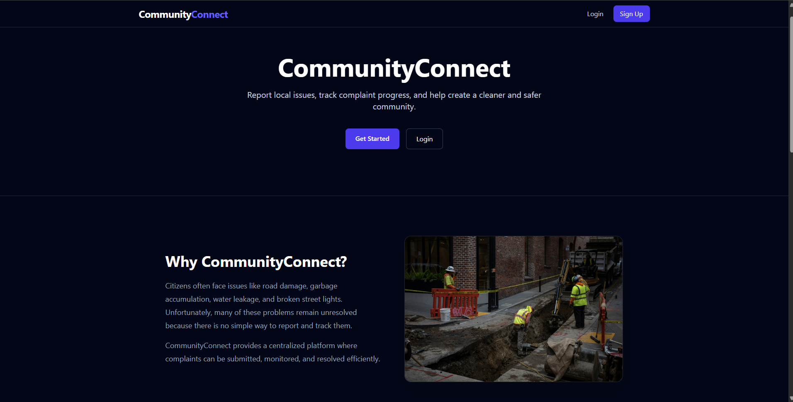
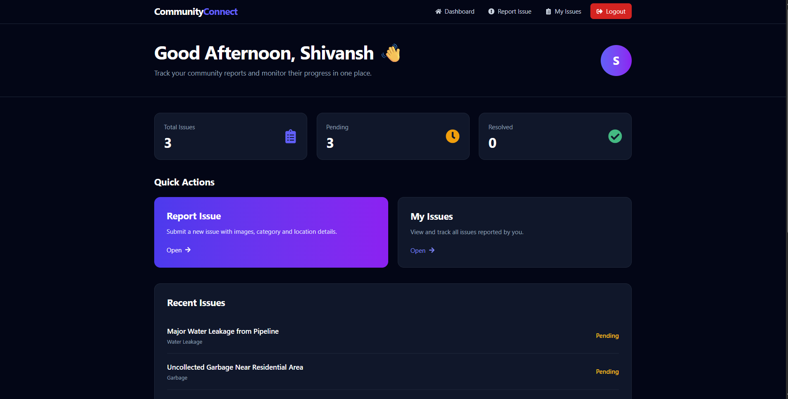
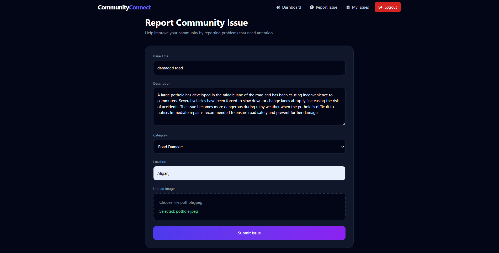
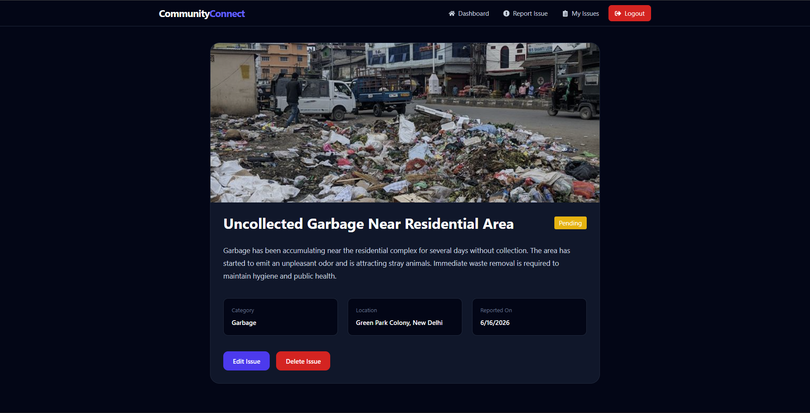
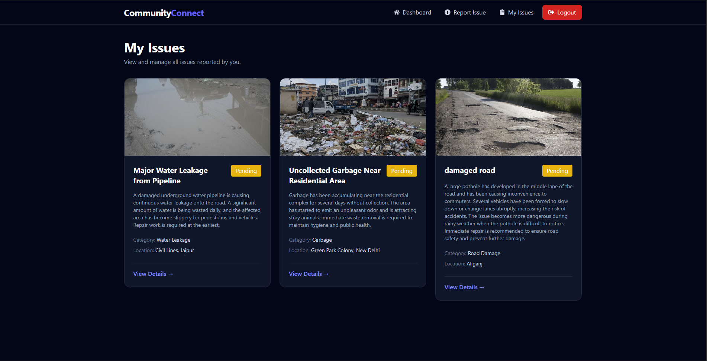
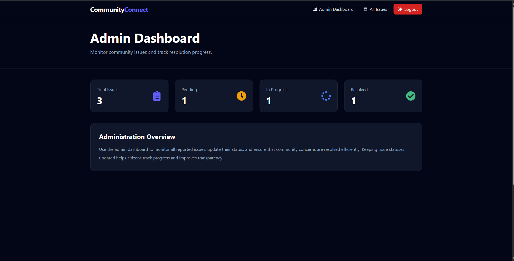
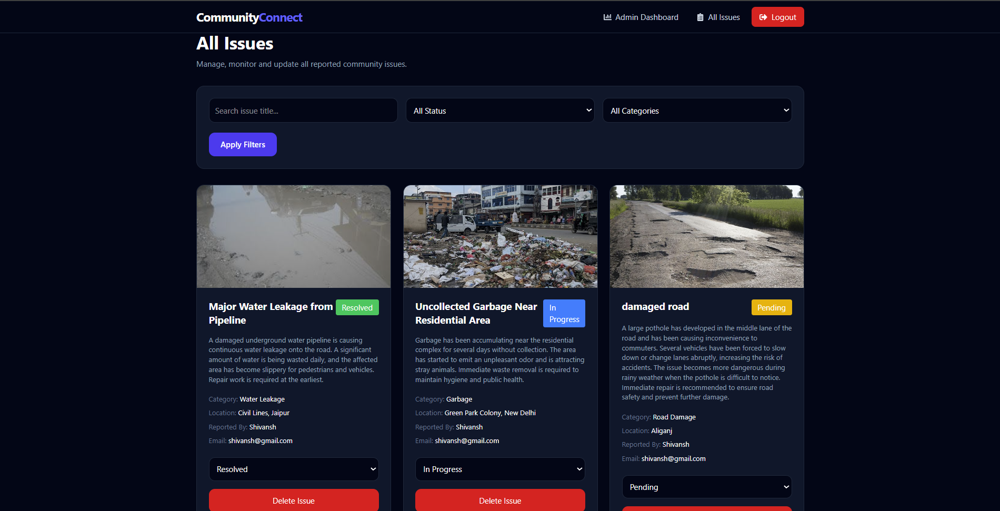

# CommunityConnect

A full-stack MERN application that enables citizens to report community issues such as road damage, garbage accumulation, water leakage, and faulty street lights. CommunityConnect bridges the gap between citizens and authorities by providing a transparent issue reporting and tracking system.

## Live Demo

**Frontend:** https://community-connect-ashy.vercel.app/

**Backend API:** https://communityconnect-ztms.onrender.com

**GitHub Repository:** https://github.com/ShivanshGera/CommunityConnect

---

## Features

### Citizen Features

* Secure user registration and login
* Report community issues with images
* Categorize issues for easier management
* Track issue status in real time
* View all personal reports
* Edit or delete pending reports
* Responsive dashboard with issue statistics

### Admin Features

* View all reported issues
* Filter issues by status and category
* Update issue status
* Delete inappropriate or duplicate reports
* Dashboard with overall platform statistics

---

## Screenshots

### Home Page



### Citizen Dashboard



### Report Issue



### Issue Details



### My Issues



### Admin Dashboard



### All Issues Management



---

## Tech Stack

### Frontend

* React.js
* React Router DOM
* Tailwind CSS
* Axios
* React Hot Toast
* React Icons

### Backend

* Node.js
* Express.js
* MongoDB Atlas
* Mongoose
* JWT Authentication
* Multer
* Cloudinary

### Deployment

* Vercel (Frontend)
* Render (Backend)
* MongoDB Atlas (Database)

---

## Project Structure

```text
CommunityConnect
│
├── client
│   ├── public
│   └── src
│       ├── api
│       ├── assets
│       ├── components
│       ├── context
│       └── pages
│
├── server
│   ├── config
│   ├── controllers
│   ├── middleware
│   ├── models
│   ├── routes
│   └── utils
│
├── screenshots
│   ├── home.png
│   ├── dashboard.png
│   ├── report-issue.png
│   ├── issue-detail.png
│   ├── my-issues.png
│   ├── admin-dashboard.png
│   └── all-issues.png
│
└── README.md
```

---

## Installation

### Clone the Repository

```bash
git clone https://github.com/ShivanshGera/CommunityConnect.git
cd CommunityConnect
```

### Backend Setup

```bash
cd server
npm install
```

Create a `.env` file:

```env
PORT=5000
MONGODB_URI=your_mongodb_connection_string
JWT_SECRET=your_secret_key

CLOUDINARY_CLOUD_NAME=your_cloud_name
CLOUDINARY_API_KEY=your_api_key
CLOUDINARY_API_SECRET=your_api_secret
```

Run the backend:

```bash
npm run dev
```

### Frontend Setup

```bash
cd client
npm install
```

Create a `.env` file:

```env
VITE_API_URL=http://localhost:5000/api
```

Run the frontend:

```bash
npm run dev
```

---

## API Endpoints

### Authentication

* POST `/api/auth/signup`
* POST `/api/auth/login`

### Issues

* POST `/api/issues/create`
* GET `/api/issues/my`
* GET `/api/issues/:id`
* PUT `/api/issues/:id`
* DELETE `/api/issues/:id`

### Admin

* GET `/api/admin/dashboard`
* GET `/api/admin/issues`
* PATCH `/api/admin/issues/:id/status`
* DELETE `/api/admin/issues/:id`

---

## Future Improvements

* Email notifications
* Google Maps integration
* Issue voting system
* Advanced analytics dashboard
* Real-time notifications
* Location-based issue filtering

---

## Author

**Shivansh Gera**

GitHub: https://github.com/ShivanshGera

---

## License

This project is licensed under the MIT License.
